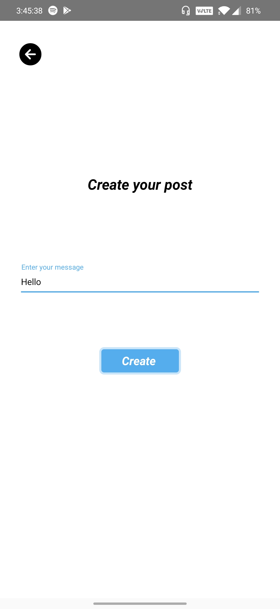

# feedbackapp
This app content basic features like,

      1.Authenticating the users.
      2.Getting the posts from users.
      3.And feeding it into the database in real time.
      4.showing them on the home page
      5.Atlast liking the post.
## Installation

- run `npm install` or `yarn install`

## Run on Device

- run `yarn android` or `yarn ios` to run on device or emulator

 ### Screenshot
 

